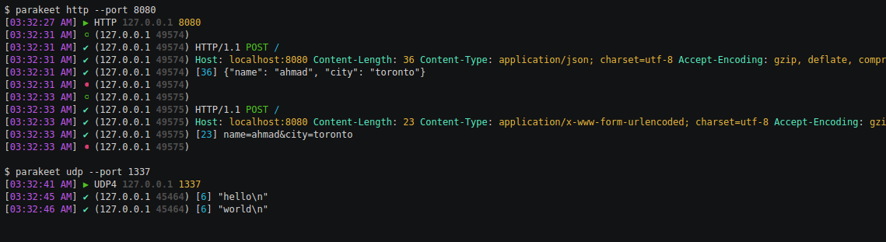

# parakeet [![version][npm-version]][npm-url] [![License][npm-license]][license-url]

> Echo server for TCP/UDP/HTTP

[![Build Status][travis-image]][travis-url]
[![Downloads][npm-downloads]][npm-url]
[![Dependencies][david-image]][david-url]



## Demo

Watch the screencast [here](https://asciinema.org/a/bz8d1x2imc5zalplndczxgtek)

## Parakeet

> The common parakeet (Melopsittacus undulatus), is a popular talking-bird species because of their potential for large vocabularies, ease of care and well-socialized demeanor.
> [https://en.wikipedia.org/wiki/Parakeet](https://en.wikipedia.org/wiki/Parakeet)

![parakeet][parakeet] 

## Message Format

| event                           | format                                                    | example                                              |
| ------------------------------- | --------------------------------------------------------- | ---------------------------------------------------- |
| server start                    | `[TIME] ▶️ TYPE LISTEN_IP LISTEN_PORT`                     | `[03:32:54 AM] ▶️ TCP 127.0.0.1 1338`                 |
| connection open                 | `[TIME] ⚪ REMOTE_IP REMOTE_PORT`                          | `[03:32:54 AM] ⚪️ TCP 127.0.1.1 1338`                 |
| connection close                | `[TIME] ⚫️️ REMOTE_IP REMOTE_PORT`                          | `[03:32:54 AM] ⚫️️️ TCP 127.0.1.1 1338`                 |
| data recieved                   | `[TIME] ✔ REMOTE_IP REMOTE_PORT [BYTES] "MESSAGE"`        | `[03:33:00 AM] ✔ (127.0.0.1 57619) [8] "hello!\r\n"` |
| http signature *(http only)*    | `[TIME] ✔ REMOTE_IP REMOTE_PORT HTTP_VERSION METHOD URL`  | `[03:32:33 AM] ✔ (127.0.0.1 49575) HTTP/1.1 POST /`  |
| http headers *(http only)*      | `[TIME] ✔ REMOTE_IP REMOTE_PORT KEY: VALUE`               | `[03:32:33 AM] ✔ (127.0.0.1 49575) Host: localhost:8080 Content-Type: application/json` |


## Sample Output

###### TCP

```
[03:32:54 AM] ▶️ TCP 127.0.0.1 1338
[03:32:57 AM] ⚪ (127.0.0.1 57619)
[03:33:00 AM] ✔ (127.0.0.1 57619) [8] "hello!\r\n"
[03:33:08 AM] ⚫️️️ (127.0.0.1 57619)
```

###### UDP

```
[03:32:41 AM] ▶️ UDP4 127.0.0.1 1337
[03:32:45 AM] ✔ (127.0.0.1 45464) [6] "hello\n"
[03:32:46 AM] ✔ (127.0.0.1 45464) [6] "world\n"
```

###### HTTP

```
[03:32:27 AM] ▶️ HTTP 127.0.0.1 8080
[03:32:31 AM] ⚪ (127.0.0.1 49574)
[03:32:31 AM] ✔ (127.0.0.1 49574) HTTP/1.1 POST /
[03:32:31 AM] ✔ (127.0.0.1 49574) Host: localhost:8080 Content-Length: 36 Content-Type: application/json; charset=utf-8 Accept-Encoding: gzip, deflate, compress Accept: application/json User-Agent: HTTPie/0.8.0
[03:32:31 AM] ✔ (127.0.0.1 49574) [36] {"name": "ahmad", "city": "toronto"}
[03:32:31 AM] ⚫️️️ (127.0.0.1 49574)

[03:32:33 AM] ⚪ (127.0.0.1 49575)
[03:32:33 AM] ✔ (127.0.0.1 49575) HTTP/1.1 POST /
[03:32:33 AM] ✔ (127.0.0.1 49575) Host: localhost:8080 Content-Length: 23 Content-Type: application/x-www-form-urlencoded; charset=utf-8 Accept-Encoding: gzip, deflate, compress Accept: */* User-Agent: HTTPie/0.8.0
[03:32:33 AM] ✔ (127.0.0.1 49575) [23] name=ahmad&city=toronto
[03:32:33 AM] ⚫️️️ (127.0.0.1 49575)
```

## Install

```bash
npm install --save parakeet
```

## Usage

```

  Usage: parakeet [options] [command]


  Commands:

    http   start HTTP echo server
    tcp    start TCP echo server
    udp    start UDP echo server

  Options:

    -h, --help               output usage information
    -V, --version            output the version number
    -p, --port <number>      port to listen on
    -a, --address <address>  network address to listen on

```

## License

----
> :copyright: [www.ahmadnassri.com](https://www.ahmadnassri.com/) &nbsp;&middot;&nbsp;
> License: [ISC](LICENSE) &nbsp;&middot;&nbsp;
> Github: [@ahmadnassri](https://github.com/ahmadnassri) &nbsp;&middot;&nbsp;
> Twitter: [@ahmadnassri](https://twitter.com/ahmadnassri)

[parakeet]: https://github.com/ahmadnassri/parakeet/blob/master/parakeet.png

[license-url]: https://github.com/ahmadnassri/parakeet/blob/master/LICENSE

[travis-url]: https://travis-ci.org/ahmadnassri/parakeet
[travis-image]: https://img.shields.io/travis/ahmadnassri/parakeet.svg?style=flat-square

[npm-url]: https://www.npmjs.com/package/parakeet
[npm-license]: https://img.shields.io/npm/l/parakeet.svg?style=flat-square
[npm-version]: https://img.shields.io/npm/v/parakeet.svg?style=flat-square
[npm-downloads]: https://img.shields.io/npm/dm/parakeet.svg?style=flat-square

[david-url]: https://david-dm.org/ahmadnassri/parakeet
[david-image]: https://img.shields.io/david/ahmadnassri/parakeet.svg?style=flat-square
